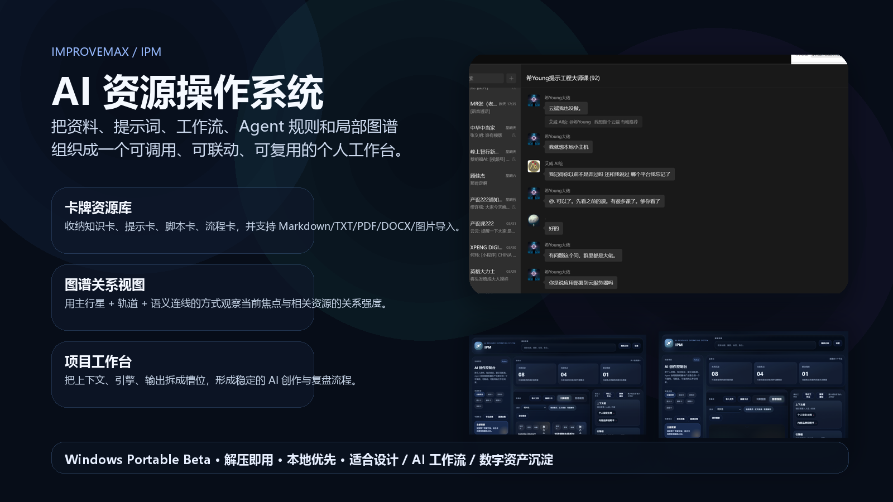
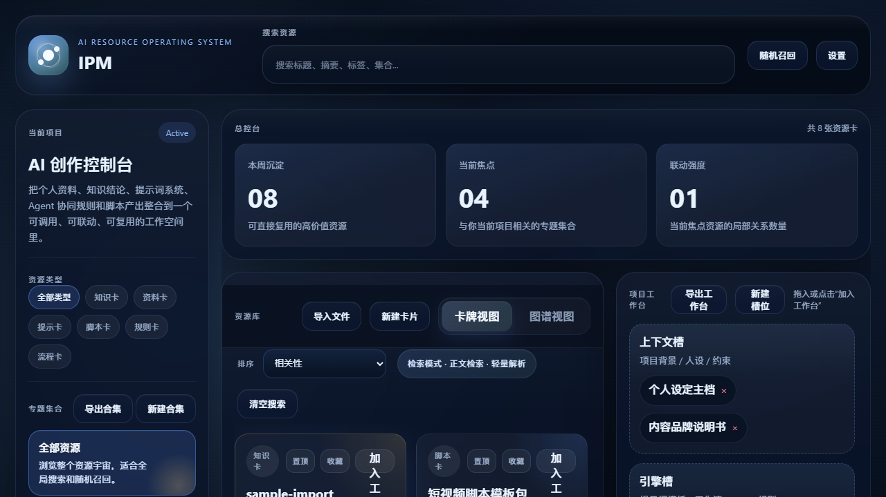
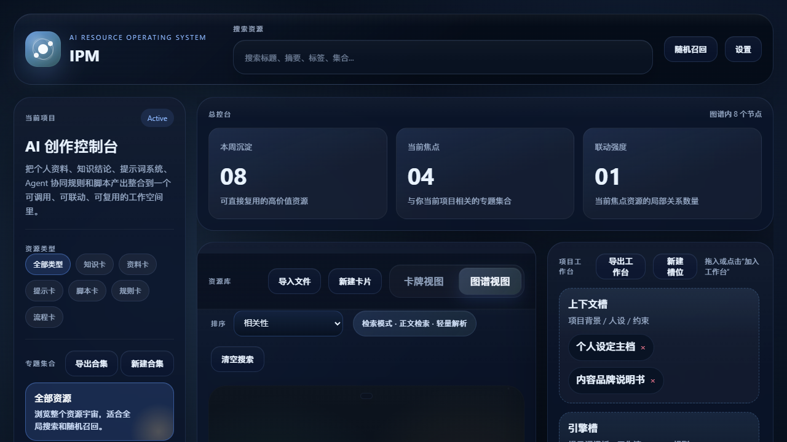

# ImproveMAX / IPM

IPM 是一个面向设计师、AIGC 创作者与 AI 工作流构建者的本地优先资源工作台。  
它把资料、提示词、工作流、Agent 规则与关系图谱组织成一个可调用、可联动、可复用的个人创作系统。

## 当前定位

- `Windows Portable Beta`
- `Local-first`
- `AI Resource Operating System / 资源操作系统原型`

这不是一个泛聊天工具，而是一个更偏“资产沉淀 + 关系组织 + 工作台编排”的个人生产系统。

## 这一版能做什么

- 浏览和管理资源卡：资料卡、知识卡、提示卡、脚本卡、流程卡、规则卡
- 导入本地文件：Markdown、TXT、PDF、DOCX、图片
- 用图谱视图观察当前焦点与集合 / 工作台 / 标签带来的关系层级
- 把资源加入工作台槽位，形成稳定的上下文 / 引擎 / 输出结构
- 导出卡片、合集和工作台内容

## 界面预览

## 下载与上手

优先看这两个文档：

- [快速开始](./docs/QUICK_START.md)
- [已知问题](./docs/KNOWN_ISSUES.md)

## 适合谁

- 想把提示词、知识结论、脚本模板和 Agent 规则沉淀成长期资产的人
- 正在建立个人 AI 工作流，而不是只追求一次性生成结果的人
- 希望把设计审美、AI 能力和数字资产组织能力串成一个长期系统的人

## 项目结构

- [`resource-workbench-demo`](./resource-workbench-demo) 浏览器版主开发场
- [`resource-workbench-app`](./resource-workbench-app) Tauri 桌面壳
- [`docs`](./docs) 对外说明、教程与发布文档
- [`assets/github`](./assets/github) GitHub 展示图与发布素材

## Beta 说明

当前版本更适合：

- 小范围试用
- 记录反馈
- 验证产品方向

还不适合：

- 作为成熟商业产品对外首发
- 承诺所有复杂导入场景和桌面环境都完全稳定

如果你在试用中遇到问题，优先记录：

- 导入的是哪种文件
- 当时是拖拽还是点击导入
- 当前视图是卡牌还是图谱
- 桌面版还是 demo 版

这些信息足够帮助继续把它推成真正可发布的产品雏形。
