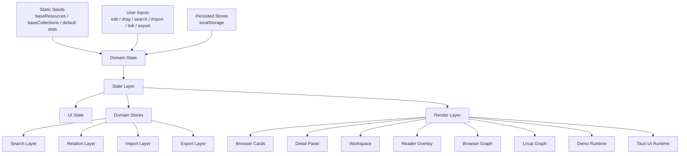
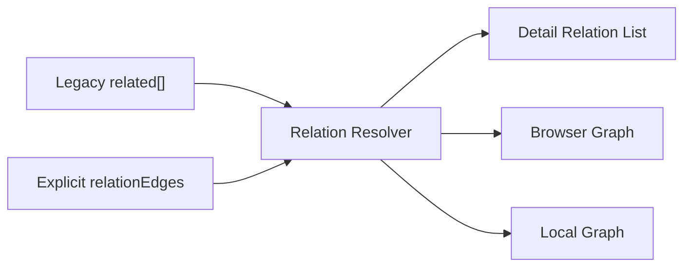

# ImproveMAX Unified Technical Blueprint

## Purpose

This document is the unified technical blueprint for the ImproveMAX product line.

It exists to align:

- product intent
- current code reality
- module boundaries
- data model rules
- refactoring direction
- verification expectations

It is written against the current implementation state, not the earlier Phase 1 planning state.

Primary implementation anchor:

- `E:\AIGC\promptagent\ImproveMAX\resource-workbench-demo\script.js`

Secondary sync target:

- `E:\AIGC\promptagent\ImproveMAX\resource-workbench-app\ui\script.js`

Desktop shell wrapper:

- `E:\AIGC\promptagent\ImproveMAX\resource-workbench-app\src-tauri\src\main.rs`
- `E:\AIGC\promptagent\ImproveMAX\resource-workbench-app\src-tauri\tauri.conf.json`

## Technical North Star

ImproveMAX should evolve into a local-first resource operating system for AI workflow assets.

From a technical perspective, that means:

1. Resource data must be explicit and durable.
2. UI state and domain state must be clearly separated.
3. Search, relation, import, export, and graph behavior must be additive rather than destructive.
4. The browser demo remains the primary implementation surface until architectural slices are stable.
5. The Tauri app should consume the same frontend behavior rather than becoming a divergent implementation.

## Current Reality

The current demo already includes substantial Phase 1 behavior:

- card CRUD
- collection CRUD
- workspace slot CRUD
- markdown and file import
- reader overlay
- browser graph and local graph
- search preferences
- pin and favorite
- relation edges
- single-card, collection, and workspace export
- persistence through `localStorage`
- zh/en toggle

The main technical issue is no longer feature absence.

The main technical issue is architectural concentration:

- one large script owns state, persistence, search, relations, import, export, rendering, and interaction wiring
- regression risk rises with every feature addition
- desktop sync currently depends on manual duplication of UI files

## Architectural Principles

### 1. Demo First

`resource-workbench-demo` is the source-of-truth implementation surface.

All new product behavior should stabilize there first, then sync into:

- `resource-workbench-app/ui/index.html`
- `resource-workbench-app/ui/styles.css`
- `resource-workbench-app/ui/script.js`

### 2. Additive Storage

New behavior must prefer additive stores over destructive schema migration.

Existing saved data should remain readable wherever possible.

### 3. Domain Before View

Business rules should live in domain-oriented helpers before being embedded in render functions.

### 4. Stable Identifiers

Every persistent entity must use a stable ID and never depend on array position for identity.

### 5. Retrieval Quality Over Surface Complexity

Search, relation clarity, import fidelity, and export usefulness are more important than adding more view modes.

## System Map



## Module Boundaries

The current code should be understood as the following logical modules, even before files are physically split.

### 1. Seed Data Module

Responsibility:

- define built-in project metadata
- define built-in resources
- define built-in collections
- define default workspace slot definitions
- define default search preferences

Current anchors:

- `appState`
- `baseResources`
- `baseCollections`
- `DEFAULT_WORKSPACE_SLOT_DEFS`
- `DEFAULT_SEARCH_PREFS`

Future extraction target:

- `modules/seeds.js`

### 2. Domain Model Module

Responsibility:

- define resource shape
- define collection shape
- define workspace slot shape
- define relation edge shape
- define resource meta shape
- define search preference shape
- expose shape guards and normalizers

Current anchors:

- `getDefaultResourceMeta()`
- `getResourceMeta()`
- `getWorkspaceSlotDefinitions()`
- `getRelationEntries()`
- `getRelatedResourceIds()`

Future extraction target:

- `modules/domain-model.js`

### 3. State Module

Responsibility:

- own mutable runtime state
- separate transient UI state from persistent domain state
- provide mutation helpers instead of ad hoc direct writes

Current runtime state splits naturally into:

- UI state:
  - language
  - active filters
  - active view
  - selected resource
  - editor modes
  - picker visibility
  - graph interaction mode
- Domain state:
  - resources
  - collections
  - workspace slot definitions
  - workspace slot assignments
  - resource meta
  - search prefs
  - relation edges

Current anchors:

- `appState`
- `resources`
- `collections`
- `resourceMeta`
- `searchPrefs`
- `relationEdges`

Future extraction target:

- `modules/state.js`

### 4. Persistence Module

Responsibility:

- load persisted data
- validate saved payloads
- normalize missing or stale fields
- save only the correct store for each mutation
- keep storage versioning explicit

Current anchors:

- `STORAGE_KEYS`
- `loadCustomResources()`
- `loadCustomCollections()`
- `loadUiState()`
- `loadResourceOverrides()`
- `loadResourceMeta()`
- `loadSearchPrefs()`
- `loadRelationEdges()`
- `saveUiState()`
- `saveResourceMeta()`
- `saveSearchPrefs()`
- `saveRelationEdges()`
- `saveCustomResources()`
- `saveCustomCollections()`
- `saveResourceOverrides()`

Future extraction target:

- `modules/persistence.js`

### 5. Search and Retrieval Module

Responsibility:

- tokenize query text
- assemble searchable surfaces
- score and sort resources
- build snippets and highlight context
- control retrieval preferences

Current anchors:

- `getSearchTokens()`
- `getSearchSortOptions()`
- `getWorkspaceMembershipSearchText()`
- `buildResourceSearchFields()`
- `buildSearchSnippet()`
- `getResourceSearchScore()`
- `getFilteredResources()`
- `renderSearchToolbar()`

Future extraction target:

- `modules/search.js`

### 6. Relation and Graph Model Module

Responsibility:

- unify static `related` links and explicit `relationEdges`
- resolve graph-visible neighbors
- assign relation type semantics
- produce edge styling rules independent of rendering container

Current anchors:

- `getRelationEntries()`
- `getRelatedResourceIds()`
- `getRelationBetween()`
- `buildRelationTypeOptionsMarkup()`
- `getGraphLineStyle()`
- `getRelationAccentClass()`

Future extraction target:

- `modules/relations.js`

### 7. Import Pipeline Module

Responsibility:

- accept dropped files or selected files
- classify supported file types
- parse markdown and lightweight file content
- create imported resource records
- preserve source metadata for search and export

Current anchors:

- `getUnsupportedImportTypes()`
- `getUnsupportedImportTypesFromItems()`
- `bindFileImport()`
- current markdown and file import helpers within `script.js`

Future extraction target:

- `modules/importers.js`

### 8. Export Pipeline Module

Responsibility:

- export one resource
- export filtered collection
- export active workspace
- support multiple formats
- include meta and relation context

Current anchors:

- `openExportPicker()`
- `bindExportPickerInteractions()`
- `buildResourceMarkdown()`
- `buildResourcePlainText()`
- `buildResourceCsvRow()`
- `buildHtmlDocument()`
- `buildResourceHtmlCard()`
- `exportCurrentResource()`
- `exportCurrentCollection()`
- `exportCurrentWorkspace()`

Future extraction target:

- `modules/exporters.js`

### 9. Reader Module

Responsibility:

- transform resource content into reader-friendly markup
- render by source type
- open and close the reader overlay

Current anchors:

- `renderGenericReaderHtml()`
- `renderImageReaderHtml()`
- `renderLinkReaderHtml()`
- `renderDocumentFileReaderHtml()`
- `openResourceReader()`
- `bindReaderInteractions()`

Future extraction target:

- `modules/reader.js`

### 10. Rendering Module

Responsibility:

- convert normalized state into DOM
- avoid embedding domain rules directly in markup assembly
- allow focused rerenders later

Main render surfaces:

- project header
- collections
- type filters
- tag cloud
- resource grid
- browser graph
- workspace lanes
- detail panel
- local graph
- metrics

Current anchors:

- `renderProject()`
- `renderCollections()`
- `renderTypeFilters()`
- `renderTagCloud()`
- `renderResourceGrid()`
- `renderBrowserGraph()`
- `renderBrowserView()`
- `renderWorkspace()`
- `renderDetail()`
- `renderGraphSmooth()`
- `renderMetrics()`
- `renderAll()`

Future extraction target:

- `modules/render/`

### 11. Interaction Module

Responsibility:

- bind top-level DOM events
- route user intent into state mutations
- keep event setup separate from domain logic

Current anchors:

- `bindQuickActions()`
- `bindTopbarActions()`
- `bindCardProximity()`
- `bindGraphProximity()`
- `bindWorkspacePickerInteractions()`
- `bindGraphPreviewInteractions()`
- `bindExportPickerInteractions()`

Future extraction target:

- `modules/interactions.js`

### 12. Platform Sync Module

Responsibility:

- keep the desktop shell consuming the same frontend surface
- minimize divergence between demo and Tauri UI
- define the sync contract between both app shells

Rule:

The Tauri app should not invent frontend behavior independently.

It should package the stabilized browser UI.

Future extraction target:

- `SYNC_CONTRACT.md`

## Core Data Model

### Resource

Resource is the primary domain entity.

Suggested canonical shape:

```json
{
  "id": "res-unique-id",
  "title": "string",
  "type": "profile | knowledge | prompt | script | workflow | agent_rule | document | image | link | file",
  "summary": "string",
  "detail": "string",
  "tags": ["string"],
  "collections": ["collection-id"],
  "related": ["resource-id"],
  "preferredSlot": "slot-id",
  "sourceType": "builtin | custom | markdown | image | link | file",
  "rawContent": "string",
  "fileName": "string",
  "mimeType": "string",
  "sourceUrl": "string",
  "createdAt": "ISO timestamp",
  "updatedAt": "ISO timestamp"
}
```

Rules:

- `id` is immutable after creation.
- `collections` holds memberships, not collection objects.
- `related` is legacy-compatible static linkage and remains readable.
- imported resources may omit fields that do not apply, but should be normalized to empty strings or arrays where possible.

### Collection

```json
{
  "id": "collection-id",
  "name": "string",
  "summary": "string",
  "isBuiltin": false
}
```

Rules:

- `all` is a reserved synthetic collection.
- built-in collections are seed data, not user-owned records.

### Workspace Slot Definition

```json
{
  "id": "slot-id",
  "label": "string",
  "description": "string",
  "isBuiltin": false
}
```

### Workspace Slot Assignment Store

```json
{
  "context": ["res-a", "res-b"],
  "engine": ["res-c"],
  "output": ["res-d"],
  "custom-slot-1": ["res-e"]
}
```

Rules:

- assignment state is not embedded into each resource.
- slot definitions and slot assignments remain separate stores.

### Resource Meta

```json
{
  "res-id": {
    "pinned": false,
    "favorite": false,
    "lastViewedAt": null,
    "lastEditedAt": null,
    "lastUsedAt": null
  }
}
```

Rules:

- missing meta must resolve to defaults.
- meta is additive and should never be required for a resource to render.

### Search Preferences

```json
{
  "sortMode": "relevance",
  "includeRawContent": true,
  "importParseMode": "light"
}
```

Rules:

- preferences affect retrieval behavior, not resource truth.
- saved preferences must always merge with defaults.

### Relation Edge

```json
{
  "id": "edge-id",
  "from": "res-a",
  "to": "res-b",
  "type": "dependency | similar | upstream | downstream | reference",
  "createdAt": "ISO timestamp"
}
```

Rules:

- explicit relation edges are the editable relation system.
- legacy `related` arrays remain supported.
- graph resolution must merge both sources.

### UI State

```json
{
  "language": "zh",
  "activeCollection": "all",
  "activeType": "all",
  "activeTag": null,
  "activeView": "cards",
  "selectedResourceId": "res-id",
  "workspaceSlots": {},
  "customWorkspaceSlots": [],
  "searchValue": "string"
}
```

Rules:

- UI state is recoverable and should never be treated as source-of-truth content.
- persisted UI state must fail safely when referenced IDs no longer exist.

## Storage Model

Current storage keys:

- `resourceWorkbench.customResources.v1`
- `resourceWorkbench.customCollections.v1`
- `resourceWorkbench.resourceOverrides.v1`
- `resourceWorkbench.uiState.v1`
- `resourceWorkbench.resourceMeta.v1`
- `resourceWorkbench.searchPrefs.v1`
- `resourceWorkbench.relationEdges.v1`

Storage rules:

1. Each store owns one concern.
2. Write only the store affected by a mutation.
3. Load functions must validate and normalize.
4. Invalid saved records should be ignored rather than crashing boot.
5. Version suffixes must change only when shape compatibility truly breaks.

## Runtime State Separation

The application should maintain two top-level state categories.

### A. Domain State

Persistent or semi-persistent business truth:

- resources
- collections
- workspace slot definitions
- workspace slot assignments
- resource meta
- search prefs
- relation edges

### B. Interface State

View and interaction context:

- selected resource
- active view
- active filters
- editor modes
- picker visibility
- graph hover mode
- drag feedback

Refactor rule:

No render function should be the first place where hidden business truth is derived if that truth can be computed once in domain helpers.

## Boot Flow

The normalized app boot sequence should be:

1. Load seed data.
2. Load persisted stores.
3. Normalize persisted data against current shapes.
4. Merge seed resources with custom resources.
5. Apply overrides.
6. Restore UI state only after domain data is ready.
7. Ensure every saved workspace slot has a live slot definition.
8. Bind interactions.
9. Render search toolbar and graph mode UI.
10. Render the full surface.

Current `init()` already approximates this and should remain the canonical boot entry until split.

## Retrieval Flow

The intended retrieval pipeline is:


Rules:

- search should query title, summary, detail, tags, collection names, slot membership, and optional raw content
- search sorting and search matching are separate concerns
- selection updates must always propagate to detail panel and local graph

## Relation Flow

The intended relation pipeline is:



Rules:

- relation editing writes only `relationEdges`
- legacy `related` remains read-compatible
- graph rendering must never assume only one relation source

## Import Flow

The import pipeline should follow this shape:

1. Accept user file input.
2. Detect supported type.
3. Parse lightweight content.
4. Create normalized resource record.
5. Attach source metadata:
   - source type
   - file name
   - mime type
   - raw content when available
6. Save resource.
7. Reindex retrieval surfaces implicitly through normal render flow.

Import design rule:

Import is not just ingestion.

Import must support later search and later export.

## Export Flow

The export pipeline should follow this shape:

1. Resolve scope:
   - current resource
   - current filtered collection
   - current workspace
2. Resolve included resources.
3. Enrich with:
   - meta
   - relation edges
   - source information
   - workspace grouping where relevant
4. Serialize by format.
5. Trigger download.

Export design rule:

Exported artifacts should remain understandable outside ImproveMAX.

## Rendering Boundaries

The render system should gradually move from one giant `renderAll()` model toward surface-level render slices.

Recommended rendering slices:

- `renderBrowserSurface()`
- `renderWorkspaceSurface()`
- `renderDetailSurface()`
- `renderGraphSurface()`
- `renderTopbarSurface()`

Interim rule:

Until physical modularization happens, any new feature should still follow logical rendering ownership and avoid putting unrelated UI updates into the same function.

## Target File Split

Recommended future split for the demo frontend:

```text
resource-workbench-demo/
  index.html
  styles.css
  script.js                # temporary composition root
  modules/
    seeds.js
    domain-model.js
    state.js
    persistence.js
    search.js
    relations.js
    importers.js
    exporters.js
    reader.js
    render/
      project.js
      browser.js
      workspace.js
      detail.js
      graph.js
      metrics.js
    interactions.js
```

Split rule:

The first physical extraction should move pure helpers first:

- domain-model
- persistence
- search
- relations
- exporters

Then render and interaction files.

## Refactoring Order

Recommended implementation order from current reality:

### Slice 1. Domain and Persistence Stabilization

- freeze canonical data shapes
- centralize normalizers
- centralize storage load and save behavior

### Slice 2. Search and Relation Isolation

- move retrieval helpers into dedicated modules
- move relation resolution into dedicated helpers

### Slice 3. Import and Export Hardening

- standardize imported resource shape
- standardize exported payload schema

### Slice 4. Render Boundary Cleanup

- split browser, detail, workspace, graph, and metrics rendering

### Slice 5. Demo to Tauri Sync Discipline

- define the UI sync process
- reduce divergence between demo and app wrapper

## Non-Goals For The Immediate Refactor

The following should not be mixed into the initial technical restructuring:

- editable graph layout persistence
- multi-project system
- undo and history
- major visual redesign
- deep PDF or DOCX architecture

These can follow after the base architecture becomes more modular.

## Quality Gates

Every architectural change should preserve:

1. card CRUD
2. collection CRUD
3. workspace slot CRUD
4. search and snippets
5. relation add and remove
6. reader overlay
7. import behavior
8. export behavior
9. persistence after refresh
10. zh/en toggle

Additional technical checks should now be treated as first-class:

1. storage compatibility
2. selection consistency across card, detail, and graph surfaces
3. export payload completeness
4. imported content retrievability
5. demo and Tauri UI behavior parity

## Definition Of Technical Completion

This blueprint is being followed successfully when:

1. The codebase has clear domain, persistence, search, relation, import, export, render, and interaction boundaries.
2. Saved data remains readable across feature iterations.
3. The demo remains the primary truth surface and the desktop app stays synchronized.
4. New features can be added without editing unrelated parts of the system.
5. Retrieval, relation, import, and export quality improve without increasing conceptual chaos.

## Immediate Next Step

The next implementation step after this blueprint should be:

1. extract and normalize the domain and persistence layer
2. keep `script.js` as a temporary composition root
3. only after that, split search and relation helpers

That order reduces regression risk while creating the technical foundation for the next phase of ImproveMAX.
