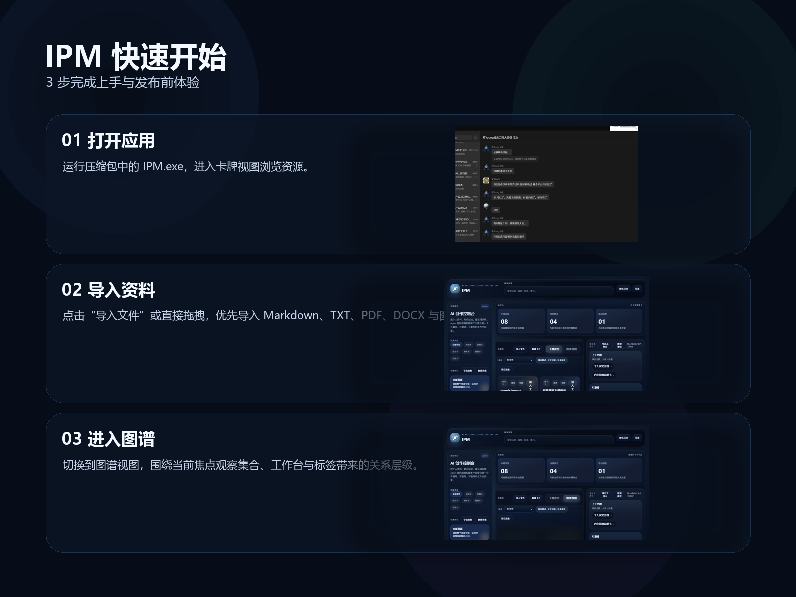

# IPM 快速开始

## 1. 解压并启动

如果你下载的是便携版压缩包：

- 解压到任意本地文件夹
- 双击 `IPM.exe`
- 首次运行建议等待几秒，让窗口与 WebView 初始化完成

如果没有正常打开：

- 先确认系统可运行 WebView2 应用
- 彻底关闭旧进程后重试

## 2. 先从卡牌视图开始

建议第一步不要直接去图谱，而是先在卡牌视图里完成两件事：

1. 浏览左侧已有集合和标签
2. 观察中间的资源卡和右侧详情区

这样你会更容易理解 IPM 的基本结构：

- 左侧：集合、标签、筛选
- 中间：资源库与图谱切换
- 右侧：详情与局部关系

## 3. 导入你的第一份资料

当前 Beta 版最稳的导入方式是：

- 点击顶部资源库里的 `导入文件`

支持的类型：

- Markdown
- TXT
- PDF
- DOCX
- 图片

如果拖拽导入在某些 Windows 环境下表现不稳定，优先使用按钮导入。

## 4. 切换到图谱视图

图谱视图不是为了展示所有卡片，而是为了看“当前焦点资源”和相关资源之间的结构。

你可以重点观察：

- 当前焦点粒子
- 强关联资源
- 集合 / 工作台 / 标签带来的关系层级
- 外围背景粒子所代表的弱相关或未聚焦资源

## 5. 把资源拖进工作台

推荐的使用方式不是只浏览，而是把资源组织成工作台：

- `上下文槽`
- `引擎槽`
- `输出槽`

这样你会更快从“收集卡片”进入“构建个人 AI 生产系统”。

## 6. 适合你的使用顺序

最推荐这条路径：

1. 先导入 3-5 份自己的 Markdown / TXT 文档
2. 给它们分配集合和标签
3. 选一张卡片进入图谱
4. 把最核心的 2-3 张卡加入工作台
5. 再观察哪些资源值得长期沉淀

## 7. 当前 Beta 版建议

- 优先把它当作个人工作流原型，不要一次性导太多杂乱资料
- 导入失败时先试按钮导入，不要立刻判断整个系统不可用
- 如果桌面版异常，可先用 demo 版确认前端流程是否正常

## 8. 下一步最值得做什么

不是继续堆卡片，而是开始形成你自己的三类资产：

- 稳定资料卡
- 可复用提示卡
- 可执行工作流

IPM 的价值不在“看起来很酷”，而在于你是否能把零散能力沉淀成持续复用的系统。
